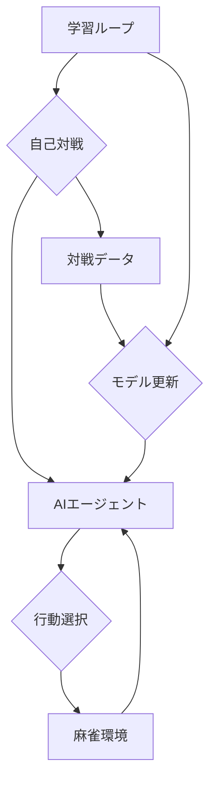

# システムアーキテクチャ

このドキュメントは、麻雀AI強化学習システムの全体設計をまとめたものです。目的は、環境（Environment）、エージェント（Agent）、および学習ループ（Training Loop）の役割とデータフローを明確にすることです。

## 1. 全体構成

システムは主に以下のコンポーネントで構成されます。

- 麻雀環境 (Environment)
- AIエージェント (Agent)
- 学習ループ (Training Loop)

以下の図はコンポーネント間の関係を示します（Mermaid記法）。

### 麻雀環境 (Environment)

役割:

- 麻雀のルールを実装し、ゲーム状態を管理する。
- エージェントからの行動（打牌、ポン、チーなど）を受け取り、状態を更新する。
- 各ステップで観測情報と報酬を返す。

要件:

- 公平で正確なルール判定。
- 学習速度のために効率的にシミュレーションできること。

検討ライブラリ:

- mahjong（mjx の Python ラッパー）
- tenhou-se
- 必要に応じて自作実装（学習効率やカスタムルールのため）

### AIエージェント (Agent)

役割:

- 環境からの観測を受け取り、次の行動を決定する。
- Transformer ベースのニューラルネットワークなどを内部モデルとして持ち、各行動の価値や確率を予測する。
- 学習ループによりモデルパラメータが更新される。

設計方針（例）:

- 観測 → エンコーディング → ポリシーヘッド/バリューヘッドの出力
- 行動は確率分布（確率的方策）か、もしくは価値推定に基づく決定。

### 学習ループ (Training Loop)

役割:

- 自己対戦を実行し、学習データ（状態・行動・報酬の系列）を収集する。
- 収集データを用いてエージェントのモデルを更新する（例: PPO）。
- モデルの評価とチェックポイント保存を定期的に行う。

処理フロー（概略）:

1. 学習ループが麻雀環境と4体のエージェント（同一モデルのコピー）を初期化する。
2. 対局を進行し、各ステップで観測を全エージェントに配布する。
3. 各エージェントは観測をモデルに入力し、行動をサンプリングして環境へ送信する。
4. 環境は状態を更新し、次の手番へ移す。
5. 半荘終了後に報酬（順位点等）を計算して、経験バッファへ格納する。
6. バッファが十分に溜まったら、ポリシー／価値ネットワークを更新する。
7. 2〜6 を繰り返す。

## 2. 技術選定

学習環境は ARM CPU 等も考慮して選定します。以下は候補です。

### 2.1 機械学習フレームワーク

- PyTorch
    - 長所: 柔軟でデバッグしやすく、コミュニティが活発。
    - 短所: JAX に比べて一部の環境で性能面で劣る可能性。

- JAX
    - 長所: jit や vmap による高速化が期待できる。
    - 短所: 学習コストや開発コストがやや高め。

選定は、ターゲットハードウェア（GPU / CPU / ARM）と既存の実装資産に依存します。

### 2.2 データフロー

対戦開始:

- 学習ループが麻雀環境と 4 体のエージェント（同一モデルのコピー）を初期化する。

対戦進行:

1. 各エージェントは環境から観測（手牌、河、ドラ等）を受け取る。
2. 観測をモデルに入力し、行動候補（打牌、鳴き）の確率分布を得る。
3. 確率分布に従って行動をサンプリングし、環境に渡す。
4. 環境が状態を更新し、次のエージェントに手番を移す。

対戦終了:

- 半荘が終了したら、各エージェントの最終報酬（順位点等）を計算する。

データ収集:

- 1 局ごと、または半荘単位で「状態・行動・報酬」の系列を経験バッファへ保存する。

モデル更新:

- バッファに溜まった経験を用いて、モデルのパラメータを更新（学習）する。

繰り返し:

- 更新済みモデルを用いて、再度自己対戦を実行する。

---

上記は基本設計です。詳細（報酬設計、観測表現、行動空間の定義、評価指標など）は別ドキュメントで補足します。
